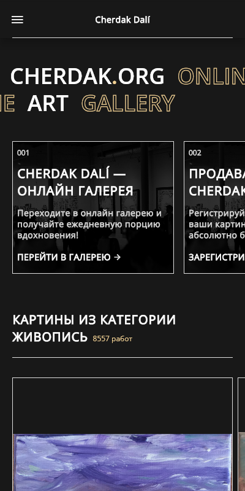
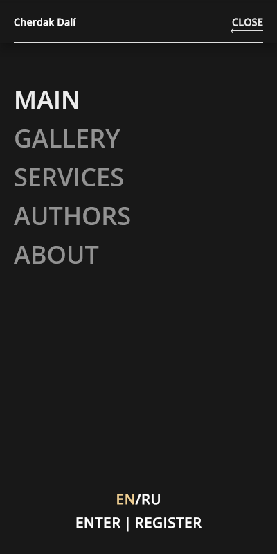
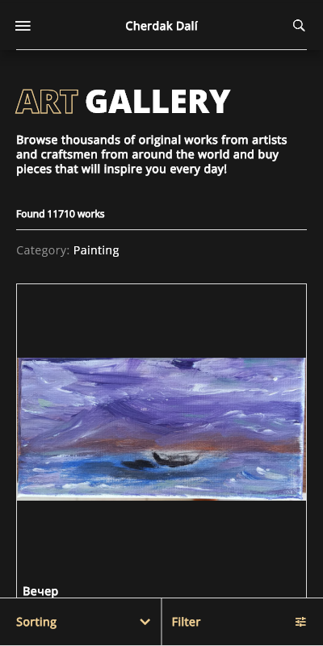

# Cherdak Dalí

Mobile application **prototype** for site **[Cherdak Dalí](https://cherdak.org)** built with 
[Flutter](https://flutter.dev)

The design is based on 
[Figma project](https://www.figma.com/file/XZZYEpV6jcpCI0gJNt2OG9/cherdak.org-(Copy)?node-id=735%3A14857&t=sHtcNoHSLLxeKWL2-1) 
found on [message page](https://cherdak.org/support_the_project) of the site.

 

  
  
  

 

This project widely uses Dart language extensions to make code shorter and prettier. 

The project uses these awesome Flutter packages:
- [riverpod](https://pub.dev/packages/riverpod) 
  for state management and dependency injection;
- [retrofit](https://pub.dev/packages/retrofit)
  to receive data via the site API;
- [flutter_hooks](https://pub.dev/packages/flutter_hooks)
  to reduce boilerplate code;
- [styled_widget](https://pub.dev/packages/styled_widget) 
  to get nice and readable widget tree code.
